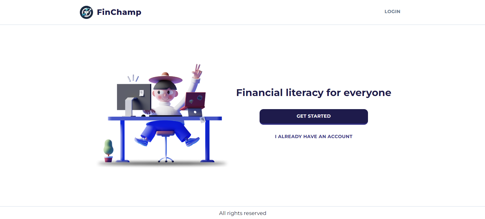
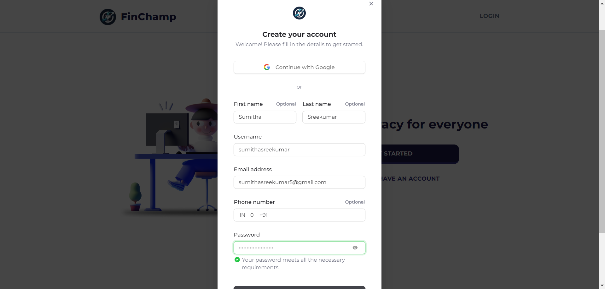
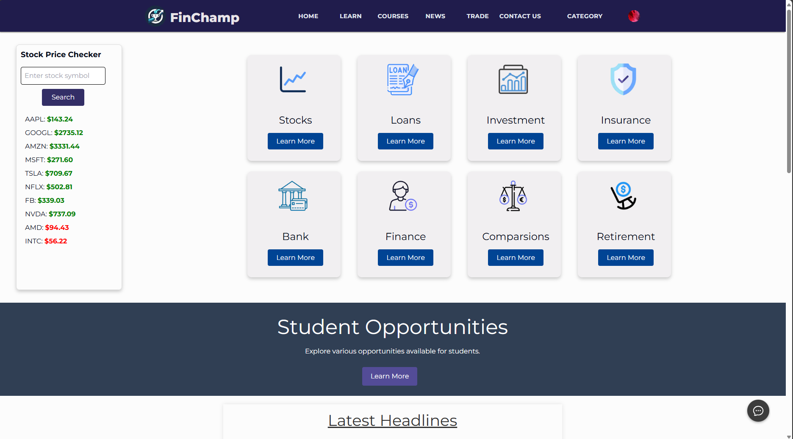

  
<!--    <h1 align="center">FinChamp</h1> -->
   

Introducing our all-in-one  Financial Companion web app, FinChamp. Tailored for students, professionals, and retirees, it offers personalised financial advice, interactive learning, product comparisons, robust security, and more. Join us to enhance your financial journey effortlessly.

## Table of Contents

- [Overview](#overview)
- [Features](#features)
- [System Requirements](#system-requirements)
- [Installation](#installation)
- [Contributers](#contributers)

## Overview

FinChamp utilises Next.js for fast performance and SEO, Drizzle + Neon for scalable databases, Clerk for secure authentication, and Botpress for real-time chatbot assistance. The web app provides a user-friendly interface to enhance financial understanding.

## Features

- Users can authenticate themselves using OTP during Registration
- Tailored financial solutions for Students, Working Professionals, and Retirees
- Interactive learning modules with quizzes and challenges.
- Easy comparison tools for credit cards, loans, and investments.
- Robust security measures with advanced data encryption.
- Access to the latest financial news and trends supported by an AI chatbot.
- Real-time virtual trading experience to monitor stock market performance.
- Rewards system and user feedback via a contact form.

## System Requirements

To run the Digital Wallet App, ensure that your development environment meets the following requirements:

- `Node.js` (v14 or higher)

## Installation

- Make sure you have Git and Node.js installed on your computer.
- Clone the repository by running the following command:
  <pre><code>
    git clone <repository-url>
  </code></pre>
   Replace <repository_url> with the  URL of the repository.
- Install Clerk and Next.js Packages by running the following command:
  <pre><code>
   npm install @clerk/nextjs@latest
  </code></pre>
  <pre><code>
   npm install lucid-react next @clerk/nextjs
  </code></pre>
- Install the app dependencies by running the following command:
   <pre><code>
    npm install
  </code></pre>
- Install dotenv Package:
  <pre><code>
   npm install dotenv
  </code></pre>
- Navigate to the /src directory of your project.
- Create a new file named .env.
- Open the .env file and paste the following content into it:

## App Screenshots

Here are some screenshots of our DigiRupi App:

   

  
  
  

  
  

<h2 id="contributers">Contributors</h2>

  <strong>
    <a href="https://github.com/Varshini2005">Varshini Gopi</a> &emsp;
    <a href="https://github.com/sumitha05">Sumitha S</a> &emsp;
    <a href="https://github.com/MEGHNAKORIM">Meghana Korimi</a> &emsp;
  </strong>

